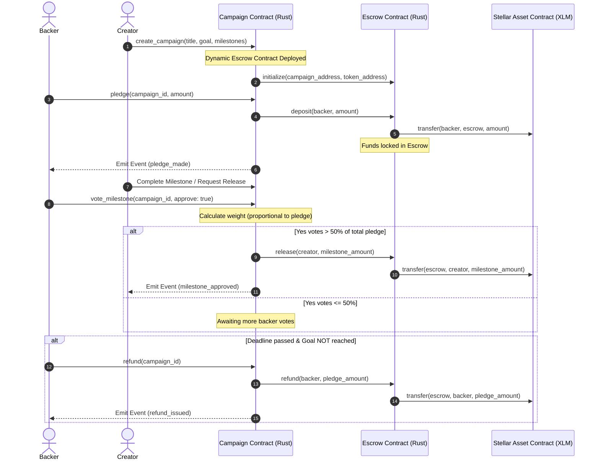
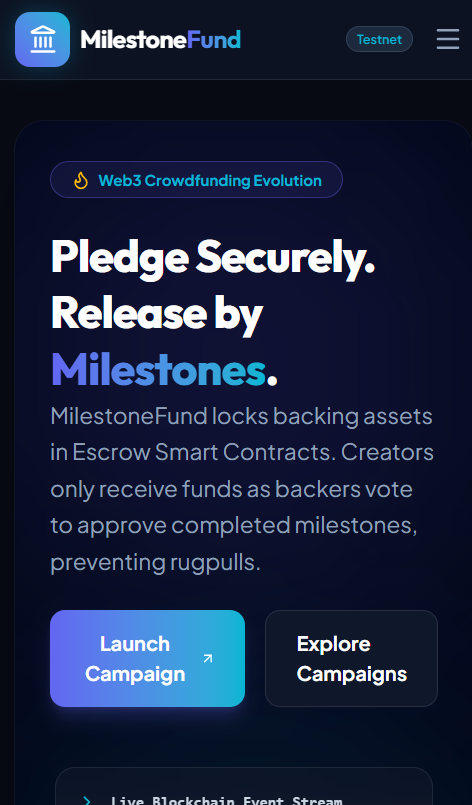
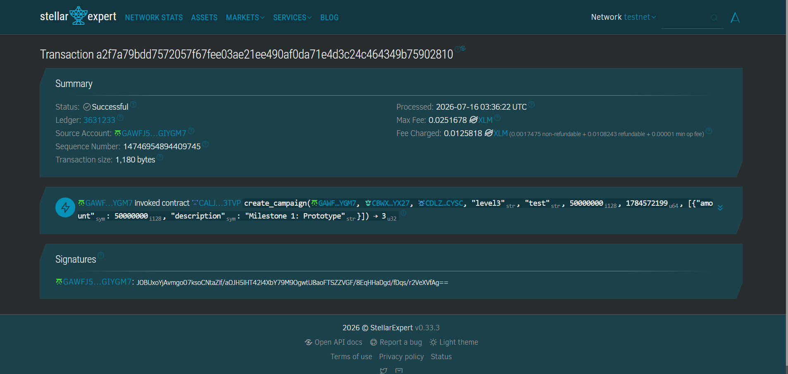
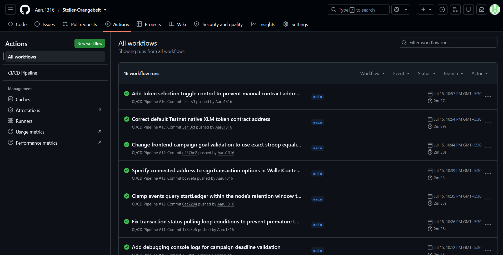

# MilestoneFund – Decentralized Milestone-Based Crowdfunding Platform

MilestoneFund is a production-ready, decentralized milestone-based crowdfunding platform built on **Stellar Soroban** using Rust and **React + TypeScript + Vite + Tailwind CSS**. 

The platform protects backers from creator abandonment or fraud by holding pledged funds (XLM) in a secure Escrow Smart Contract. Funds are released to the campaign creator sequentially, only after backers vote and approve each completed milestone.

---

## 🏗️ Architecture & Interaction Diagram

Below is the interaction flow between the Backer, Creator, Campaign Contract, and Escrow Contract:



---

## 📸 Screenshots & Demos

### 📱 Mobile Responsive UI
*Here is a preview of the platform's mobile-responsive user interface showing the dashboard and campaign creation views:*



---

## 📁 Project Folder Structure

```
milestone-fund/
├── .github/workflows/
│   └── ci.yml               # GitHub Actions CI/CD configuration
├── contracts/
│   ├── .cargo/
│   │   └── config.toml      # Workaround flags for reference-types
│   ├── campaign/
│   │   ├── src/
│   │   │   ├── lib.rs       # Campaign Contract logic
│   │   │   └── test.rs      # Rust unit tests
│   │   └── Cargo.toml       # Campaign Cargo package specs
│   ├── escrow/
│   │   ├── src/
│   │   │   └── lib.rs       # Escrow Contract logic
│   │   └── Cargo.toml       # Escrow Cargo package specs
│   └── Cargo.toml           # Root workspace config
├── frontend/
│   ├── src/
│   │   ├── __tests__/
│   │   │   └── App.test.tsx # Frontend unit tests (Vitest)
│   │   ├── components/
│   │   │   ├── CampaignCard.tsx
│   │   │   └── Navbar.tsx
│   │   ├── context/
│   │   │   └── WalletContext.tsx # Freighter integration context
│   │   ├── pages/
│   │   │   ├── Home.tsx
│   │   │   ├── Dashboard.tsx
│   │   │   ├── CreateCampaign.tsx
│   │   │   └── CampaignDetails.tsx
│   │   ├── utils/
│   │   │   └── soroban.ts   # RPC connections and SDK calls wrapper
│   │   ├── App.tsx          # Router and entrypoint
│   │   └── index.css        # Tailwind configurations
│   ├── vite.config.ts       # Vite + Vitest configuration
│   └── package.json         # Node.js dependencies configuration
├── scripts/
│   └── deploy.js            # Automatic deployment and account funding script
└── README.md
```

---

## 🛠️ Tech Stack

*   **Smart Contracts:** Rust, Soroban SDK (v21.7.7), `wasm32v1-none` compilation target.
*   **Frontend:** React 19, TypeScript, Vite 8, Tailwind CSS v4, Lucide Icons, Headless elements.
*   **Wallet Integration:** `@stellar/freighter-api` (Freighter Wallet).
*   **Blockchain Client:** `@stellar/stellar-sdk` (connecting to Soroban RPC).
*   **Testing:** Cargo Test (Rust), Vitest + Happy-DOM + React Testing Library (Frontend).

---

## 📜 Smart Contract Addresses (Testnet)

The contracts have been compiled using `wasm32v1-none` and deployed on the **Stellar Testnet**:

*   **Deployer Account Address:** `GA2XSJVTLCQHAKG7DNHKE33GETBVGX4JIDOEVAUQIRUUFFQ7VWY4WSWQ`
*   **Escrow WASM Hash:** `eb4ef9cc926d92116c984af18cf888a531047486d6ebc9e672433c6354626613`
*   **Escrow Contract Address (ID):** `CACAATRLLNDKGD3FHA4XLUKKEMGRUESPML5PFETGXSPYERUJZP5LKPWK`
*   **Campaign Contract Address (ID):** `CALJXWAACIBVO7ERMODME6W2VLET3Q2BT4ULWAECE3OUHPWAHADM3TVP`

### 🔗 Transaction Hashes
*   **Escrow Contract Deployment Tx:** `c2c6ebd73ec51bc0d998534d3e13257ccd9145c94ea98e949e40a210fd46fcb1`
*   **Campaign Contract Deployment Tx:** `cbe28508bfab5c325c4b4dd7c302de1e237e81c9ba2e1c523ae8f1711e14de38`

You can verify these deployments on the [Stellar Expert Explorer](https://stellar.expert/explorer/testnet/).

---

## ⚡ Installation & Local Setup

### Prerequisites
*   [Rust & Cargo](https://rustup.rs/) (v1.82+)
*   [Node.js](https://nodejs.org/) (v20+)
*   [Stellar CLI](https://developers.stellar.org/docs/build/smart-contracts/getting-started/setup) (v27.0.0+)
*   [Freighter Wallet Extension](https://www.freighter.app/) installed in your browser.

### 1. Clone & Set Up Cargo Workspace
Navigate to the `contracts` directory, add the compile target, and install dependencies:
```bash
cd contracts
rustup target add wasm32v1-none
cargo check
```

### 2. Deploy Smart Contracts to Testnet
You can deploy the contracts to Stellar Testnet instantly. This script builds the WASM bytecode, funds the deployer account, uploads and deploys both contract instances, and exports their addresses to the frontend configuration file:
```bash
# Run from the project root directory
node scripts/deploy.js
```

### 3. Start the Frontend App
Navigate to the `frontend` directory, install packages, and boot the Vite development server:
```bash
cd frontend
npm install
npm run dev
```
Open your browser and navigate to `http://localhost:5173`. Make sure your Freighter wallet is toggled to **Testnet** under settings.

---

## 🧪 Testing Instructions

### Rust Smart Contract Tests
Run unit tests checking campaign creation, deposits, voter weighting, milestone approvals, cross-contract calls, and refund conditions:
```bash
cd contracts
cargo test
```

### React Frontend Tests
Run Vitest unit tests checking rendering, Freighter wallet connections, progress bars, and pledge inputs:
```bash
cd frontend
npm run test
```

### 🧪 Tests Execution Output
*Here is a screenshot of the successfully passing test suite (3+ unit tests) for both Smart Contracts and React Frontend:*



---

## 🚀 CI/CD Pipeline

The project includes a GitHub Actions configuration `.github/workflows/ci.yml` that automatically runs on pushes/PRs to `main` and `master` branches:
1.  **Lints:** Runs `cargo fmt --check` and `cargo clippy -- -D warnings` on smart contracts.
2.  **Rust Tests:** Compiles target WASM binaries and executes `cargo test`.
3.  **Frontend Build:** Installs node modules, executes frontend tests `npm run test`, and validates production compilation `npm run build`.

### ⚙️ GitHub Actions CI/CD Pipeline Running
*Here is a screenshot of the automated lint, formatting, smart contract build, and frontend compilation checks passing on GitHub Actions:*



---

## 🔮 Future Improvements

1.  **Dynamic Token Support:** Support custom Stellar ERC-20 equivalent tokens for pledging instead of native XLM only.
2.  **Dispute Resolution:** Implement third-party arbitrage or multi-sig veto configurations if a milestone is rejected by backers but disputed by creators.
3.  **Governance Extensions:** Implement quadratic voting or non-transferable NFT badge boosters to backer voting weights.

---

## 📄 License
This project is licensed under the MIT License.
